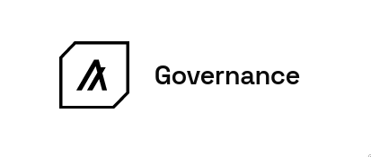

Overview
--------

We analyzed the top eligible wallets enrolled for Algorand Governance
Period 4 as of August 21, 2022. The data shows a very \"whale\" heavy
distribution of voting power and rewards, where the top 37 individual
\"whale\" wallets control the vote and reap 50% of rewards, and wallets
with over 1 million ALGO commitment control 86% of the vote and rewards.

Data Sources
------------

To get our raw data, we used two different data sources and correlated
them to confirm correctness:

1\) the [CSV
export](https://governance.algorand.foundation/api/periods/governance-period-4/governors/governors-csv-list/)
at the [foundation website period 4
page](https://governance.algorand.foundation/governance-period-4/governors)

2\) The tryalgorand.com API which powers
[algorandstats.com](https://www.algorandstats.com/governance-period-4)
(see Appendix B)

After sorting by commitment (and then address) there was no discrepancy
between the two data sets.

Filtering Data
--------------

We included only eligible wallets as of August 21, 2022 and focused on
committed stake of 1M Algo and above.

We chose to ignore the top wallet (EPYLSP..Z7OMOQ) as it
is the Folks Finance wallet and does not represent a single \"whale\"
entity.

Data highlights
---------------

Top 12 whale wallets: 20%+ of stake.

Top 28 whale wallets: 40%+ of stake.

**Top 37 whale wallets: 50% stake, control vote.**

Top 99 whale wallets: 80% of stake.

**Top 211 wallets with 1M+ ALGO: 86%+ of stake.**

\"Whale wallets\" refers to high commitment wallets *excluding* Folks
Finance.

Commentary
----------

The current governance model risk-reward ratio heavily incentivises risk
averse Algo holders to hold passively in Governance and exclude their
Algo from the on-chain economy of DeFi, NFT, GameFi, and so on.

Governance was a good bootstrapping measure while the Algorand on-chain
ecosystem was in its infancy, but we currently have multiple active DEX,
a booming NFT community and interesting projects in GameFi, tokenized
investments, music, etc.

Changing these incentives to offer fewer rewards will incentivize some
of these holders to enter the Algorand on-chain economy.

Crucially, even for users who do not want to take the risks associated
with actually using their Algo, the option of reducing their own rewards
will reap multiplied dividends in the future: to us, the choice is
between 7-8% APR of a top 30 coin, or (less) APR of a top 10 coin.

Algorand attracted us to build on it for the superior technology and we
need to collectively decide to stop disincentivising actually using this
superior technology for the ecosystem to flourish. The upcoming
Governance proposal to redirect some Governance rewards towards DeFi  is
a good start.

If you are still not convinced, ask yourself:

How will Algorand become a top 10 blockchain if 55% of all circulating
Algo (3.8B / 6.8B) commits to not being used?

We want to attract builders to our chain, but what can a builder create
on-chain that will compete with zero-risk 7-8% APR?

Appendix A: Data
----------------

Our spreadsheet is available as a public [Google
Spreadsheet](https://docs.google.com/spreadsheets/d/1ATSCFV-YuLS9hH5tYteIbv9bBfmrcQoY0-PJcG2L-28),
or you can download an
[xlsx](top-whale-wallets-gov-period-4.xlsx)
or
[CSV](top-whale-wallets-gov-period-4.csv).

The raw data we collected are available as CSV:

[Algorand Foundation CSV
export](foundation-data.csv)

[AlgorandStats.com API
data](tryalgorand-data-sorted.csv)

Appendix B: Sourcing data: Algorandstats.com / tryalgorand.com API {#appendix-b-sourcing-data-algorandstatscom-tryalgorandcom-api}
------------------------------------------------------------------

We downloaded the algorandstats.com data with a script like this:

```
for i in $(seq 1 25); do
  curl 'https://www.tryalgorand.com/api/governance/governance-period-4/all/committedAlgos/asc/'$i -H 'User-Agent: Mozilla/5.0' -H 'Accept: */*' -H 'Accept-Language: en-US,en;q=0.5' -H 'Accept-Encoding: gzip, deflate, br' -H 'Referer: https://www.algorandstats.com/' -H 'Origin: https://www.algorandstats.com' -H 'DNT: 1' -H 'Connection: keep-alive' -H 'Sec-Fetch-Dest: empty' -H 'Sec-Fetch-Mode: cors' -H 'Sec-Fetch-Site: cross-site' > $(printf "data-%02d" $i);
  sleep 0.5;
done
```

Then filtered eligible wallets and converted to CSV using jq:

```
jq -r '.results[] | select(.is_eligible==1) | [.address, .committed_algo_amount, .committed_algo_amount / 1000000] | @csv' data-* > tryalgorand-data.csv
```

After sorting by committed amount (and address), the data set was
identical to the Foundation CSV export, so we assume it to be correct.
